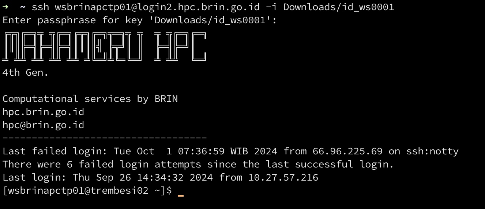
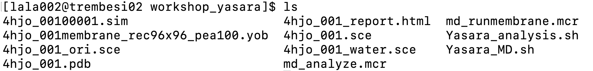

# HPC Summer School 2024: Foundation in Computational Biomolecular and Biosystem Research

This guide demonstrates how to analyze molecular dynamics data using the MAHAMERU BRIN HPC. In this workshop, all necessary software is pre-installed as modules, including ORCA (for quantum chemistry calculations), while Yasara Structure (licensed) is already set up on local computers. Therefore, no additional environment setup is required. To run the examples, simply click the top-right corner of each code box to copy the provided snippets, and paste them directly into your terminal.

## Login to MAHAMERU
#### Make sure you have the private key file (`id_ws000i`)
Ensure that you have the private key file `id_ws000i` saved in a specific folder or directory on your system. You will need this file for authentication.
- Linux/MacOS: Press `Ctrl + Alt + T` to open your terminal or search for "Terminal" in your applications.
- Windows: Open PowerShell by typing "PowerShell" in the Start Menu.

#### Locate your private key (`id_ws000i`)
Find the directory where you saved your private key file (`id_ws000i`). For example:

- If the key file is saved in the `Downloads` directory on Linux/MacOS, the path might look like `/home/your-username/Downloads/id_ws000i`.
- On Windows, it might be something like `C:\Users\your-username\Downloads\id_ws000i`.

#### Use the ssh command with the correct path
Now, using your terminal (or PowerShell), type the following command to initiate the SSH connection:
```
ssh wsbrinapctp0i@login2.hpc.brin.go.id -i /full/path/to/id_ws000i
```
Example
If the `id_ws000i` file is stored in `/home/username/Downloads/id_ws000i` on a Linux/MacOS system, the command will look like:
```
ssh wsbrinapctp0i@login2.hpc.brin.go.id -i /home/username/Downloads/id_ws000i
```
For a Windows system, if the file is in `C:\Users\username\Downloads\id_ws000i`, the command will be:
```
ssh wsbrinapctp0i@login2.hpc.brin.go.id -i C:\Users\username\Downloads\id_ws000i
```

If this is your first time connecting to `login2.hpc.brin.go.id`, you'll be asked to confirm the host identity. Type `yes` to continue.
If your private key (`id_ws000i`) is encrypted, you'll be prompted to enter the passphrase associated with the key.
type:

`brinapctp` as the passphrase.

The system will not display characters as you type, but simply press `Enter` after typing.

After completing these steps, you should be successfully connected to the `trembesi02` login node of the HPC BRIN system.




## Creating a New Working Directory
To keep your files organized, create a directory named `workshop_yasara` under your home directory by typing the following command:
```
mkdir workshop_yasara
```
To navigate to the newly created `workshop_yasara` directory, type:
```
cd workshop_yasara
```
Press Enter.

## Sending Your Preparation Job from Your Laptop
To send files from your laptop to the remote directory using SCP (Secure Copy Protocol), type the following command (in your laptop):
```
scp ~/Downloads/id_ws000i wsbrinapctp0i@login2.hpc.brin.go.id:/mgpfs/home/wsbrinapctp0i/workshop_yasara/

```
Here:

- `~/Downloads/id_ws000i` is the location of your private key file in the Downloads directory.
- `wsbrinapctp0i` is your remote username.
- `login2.hpc.brin.go.id` is the remote host.
- `/home/wsbrinapctp0i/workshop_yasara/` is the destination folder on the remote server.

Alternatively, if you want to copy a folder, make sure that the "workshop_yasara" directory exists on the HPC. If it hasn’t been created yet, you can create the directory while copying the folder using this command:

```
scp -rp workshop_yasara wsbrinapctp0i@login2.hpc.brin.go.id:/mgpfs/home/wsbrinapctp0i/
```
Once the command is executed and you’ve authenticated, the folder `workshop_yasara` and its contents will be transferred to the specified directory on the HPC.


## Verifying File Upload
Back on the terminal connected to the HPC, verify that the files have been uploaded successfully by listing the contents of the current directory, type:
```
ls
```
You should see a list of your uploaded files.



## Submitting the Job
To submit a job for execution on the HPC cluster, use the sbatch command followed by the script name. In this example, the script is called Yasara_MD.sh, which contains the necessary instructions for running the molecular dynamics simulation.

#### Yasara_MD.sh Script Contents
```
#!/bin/bash

#SBATCH --nodes=1              # Request 1 node
#SBATCH --ntasks=4             # Request 4 CPU cores
#SBATCH --mem=16GB             # Request 16 GB of memory
#SBATCH --partition=medium-large  # Specify the partition to use

#SBATCH --output=md_analyze.out  # Save standard output to md_analyze.out
#SBATCH --error=md_analyze.err   # Save error messages to md_analyze.err

FILE_INPUT=md_analyze.mcr  # Define the input file for the simulation

yasara -txt ${FILE_INPUT}  # Run Yasara using the specified input file
```

Explanation of the Script:
- `#!/bin/bash`: This line specifies the script will be executed in a Bash shell.
- `#SBATCH --nodes=1`: Allocates 1 compute node for the job.
- `#SBATCH --ntasks=4`: Requests 4 tasks (or CPU cores) for parallel execution.
- `#SBATCH --mem=16GB`: Allocates 16 GB of memory to the job.
- `#SBATCH --partition=medium-large`: Specifies the partition (queue) to submit the job to, in this case, a medium-large queue suitable for moderately resource-intensive tasks.
- `#SBATCH --output=md_analyze.out`: Redirects the standard output to the md_analyze.out file.
- `#SBATCH --error=md_analyze.err`: Redirects error messages to the md_analyze.err file for debugging.
- `FILE_INPUT=md_analyze.mcr`: Defines the input file for the molecular dynamics simulation.
- `yasara -txt ${FILE_INPUT}`: Runs the Yasara program in text mode using the input file md_analyze.mcr.


Then, to submit this job to the HPC scheduler (SLURM), run the following command in your terminal:
```
sbatch Yasara_MD.sh
```
#### What Happens When You Submit:
- The `sbatch` command submits the job to SLURM, the job scheduling system used by the HPC.
- The scheduler then queues your job and assigns it the required resources (CPU, memory, etc.) once available.
- The simulation will run, with its output saved in `md_analyze.out` and any errors captured in `md_analyze.err`.
- This process ensures that your molecular dynamics simulation runs efficiently on the HPC cluster.


## Checking Job Status
After submitting your job, you can monitor its progress using the `squeue` command. This command allows you to view the status of jobs currently in the queue.
```
squeue -u wsbrinapctp0i
```
Explanation:

- `squeue` is used to query the scheduler for jobs that are either waiting or running.
- `-u` specifies the user, and 
- `wsbrinapctp0i` automatically fetches your username, so it shows the jobs associated with your account.

## Interpreting the Job Status
Once you run the squeue command, you'll see a list of jobs along with their details. The important column to note is the "ST" column, which represents the status of your job. 
Here are common job statuses:
- `**R**`: The job is Running.
- `**PD**`: The job is Pending, meaning it's in the queue and waiting for resources.
- `**CG**`: The job is Completing, meaning it is finishing up.

If everything is working correctly, the status (`**ST**`) should display as `**R**`, indicating that your job is actively running on the cluster.

## Monitoring Output in Real-Time
To check the real-time progress of your job, you can use the tail -f command to monitor your output file. For example, if your job is running a molecular dynamics simulation and writing output to a file called md_runmembrane.mcr, you can view the live updates with this command:
```
tail -f md_runmembrane.mcr
```
Explanation:
- `tail -f` continuously displays the last few lines of the file, and it updates in real-time as new lines are added.
- `md_runmembrane.mcr` is the name of the output file where the progress of your job is being logged.

This allows you to track the progress of your job without waiting for it to finish.

## Analysing MD results
After the simulation is completed, you can analyze the molecular dynamics results. To do so, modify your Yasara_MD.sh script to use md_analyze.mcr as the input for the analysis.

Step-by-Step Guide to Edit Using vi
1. Open the File In the terminal, type:
```
vi Yasara_MD.sh
```
2. Enter Insert Mode Press `i` to start editing the file.
```
#!/bin/bash
  
#SBATCH --nodes=1
#SBATCH --ntasks=64
#SBATCH --mem=32GB
#SBATCH --partition=medium-large

#SBATCH --output=md_runmembrane.out
#SBATCH --error=md_runmembrane.err

yasara_exec=/mgpfs/home/lala002/apps/yasara/yasara

FILE_INPUT=md_runmembrane.mcr

nice -n 20 ${yasara_exec} -txt ${FILE_INPUT}

```

Edit the File Add the line:
`md_runmembrane`
into
`md_analyze`

4. Save and Exit
Press `Esc` to exit editing mode.
Type `:wq` and press Enter to save and quit vi.

## Closing the Terminal
Even though the job may take some time to complete, you can safely close the terminal. The job will continue running in the background on the HPC system until it's finished. You can always reconnect later and check the status using the `squeue` command again.

By using `sbatch`, the job is handled by the scheduler independently of your terminal session, so there's no need to keep the terminal open while the job runs.


